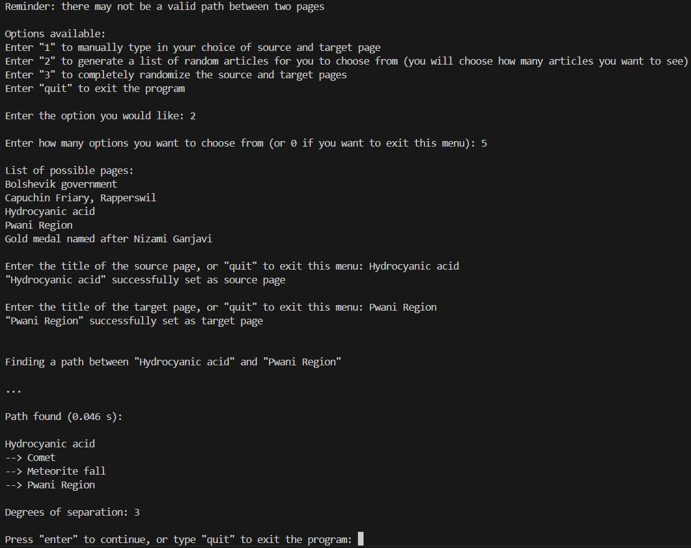
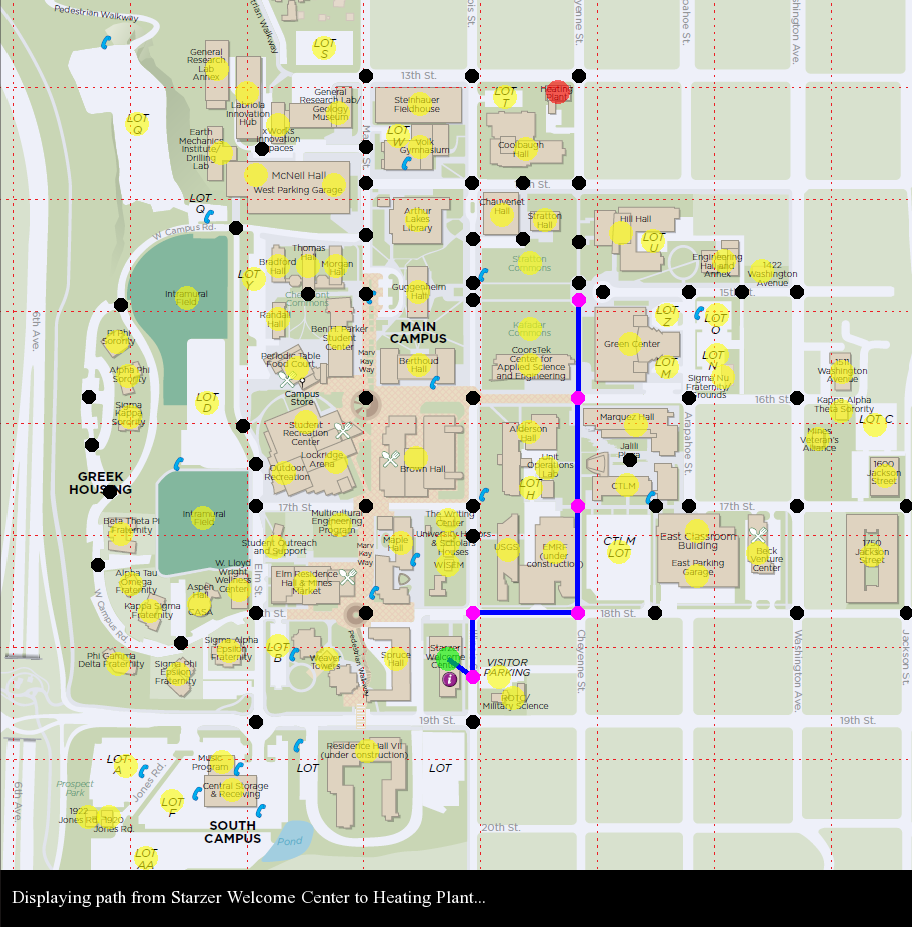
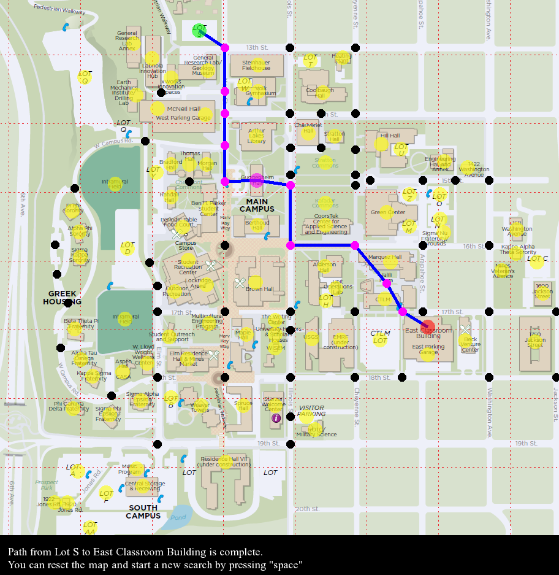

# Graph Traversal Applications (Wikipedia Game Solver and Campus Navigator)

**A C++ project exploring unweighted and weighted graph data structures through two distinct applications.**

An unweighted graph is used to solve the Wikipedia Game, finding the shortest path between two Wikipedia articles using the links between them. The program uses a dataset of 100,000 Wikipedia pages and 28,855,738 links. A weighted graph is used in a Campus Navigator tool for Colorado School of Mines, which uses SFML to visually display and animate the shortest path between two locations. A custom dataset was created to map the locations of buildings, intersections, and the connections between them using a map image adapted from [Colorado School of Mines](https://tour.mines.edu/map/).


## Screenshots

### Wikipedia Game Solver


### Campus Navigator
<table>
  <tr>
    <td></td>
    <td></td>
  </tr>
</table>


## Key Features

* **Wikipedia Game Solver**
  * Developed an unweighted graph data structure using an adjacency list to represent a set of vertices and edges between them in a memory-efficient manner.
  * Parsed a dataset of 100,000 pages and 28,855,738 links, handling CSV formatting for commas and quotes, to create an unweighted graph representing the pages and their connections.
  * Implemented and used the Breadth-First Search (BFS) algorithm to find the guaranteed shortest path between two Wikipedia pages via their links, displaying the chain of articles along the path and the degrees of separation.
  * Engineered an interactive CLI with input error handling, allowing users to enter pages manually or generate random pages.


* **Campus Navigator**
  * Engineered a memory-efficient weighted graph data structure using an adjacency list to represent campus locations as vertices and paths between locations as edges.
  * Created and processed a custom CSV dataset mapping campus locations and intersection positions, and the connections between them, to model real-world physical distances and paths.
  * Integrated SFML to create a graphical user interface, guiding users with text-based outputs, allowing them to interact with the campus map via mouse and keyboard inputs.
  * Implemented and used Dijkstra's algorithm to find the guaranteed shortest path between two campus locations, animating the resulting path using SFML to display it to the user.


## Algorithm Performance

| Application | Data Structure | Algorithm | Time Complexity | Space Complexity |
| :--- | :--- | :--- | :--- | :--- |
| **Wikipedia Game Solver** | Unweighted Graph (Adjacency List) | Breadth-First Search (Queue) | $O(V + E)$ | $O(V)$ |
| **Campus Navigator** | Weighted Graph (Adjacency List) | Dijkstra's algorithm (Priority Queue) | $O((V + E) \log V)$ | $O(V + E)$ |


## Building and Running

**Prerequisites**
* Compiler and Standard: g++ (C++17)
* Build System: GNU Make
* External Libraries: SFML 2.5+ for Campus Navigator (tested on SFML 2.6.2)
> **Note:** If needed, SFML can be installed via your system package manager:
> * **macOS:** `brew install sfml`
> * **Linux (Ubuntu/Debian):** `sudo apt install libsfml-dev`
> * **Windows:** Download from the [Official SFML Website (2.6.2)](https://www.sfml-dev.org/download/sfml/2.6.2/).


### Build and Execution
1. **Clone the repository**
    ```bash
    git clone https://github.com/f-p-0/graph-traversal-applications.git
    cd graph-traversal-applications
    ```

2. **Run Wikipedia Game Solver**
    * From the project root directory:
      ```bash
      cd wikipedia_game
      make
      ./wikipedia_game
      ```
    > **Note on Wikipedia Game Solver dataset:** By default, this program runs using a sample dataset (100 pages and mock links between them) included in `wikipedia_game/wikipedia_data` for quick testing. To run using the full dataset, you can download `pages_export.csv` and `links_export.csv` from [Kaggle](https://www.kaggle.com/datasets/kutayahin/wikipedia-link-graph-100k) (created by Kutay Şahin) and place the CSV files into the `wikipedia_game/wikipedia_data/` folder (keep these exact filenames so the program can load them).

3. **Run Campus Navigator**
    * From the project root directory:
      ```bash
      cd campus_navigator
      make
      ./campus_navigator
      ```
    > **Note on Campus Navigator:** The window size has been fixed to prevent resize events from distorting the image or hiding parts of the UI, while also ensuring accurate coordinate mappings.


## Project Structure

```text
graph-traversal-applications/
├── .gitignore                         # git ignore rules
├── README.md                          
├── assets/                            # Images used in README
│   ├── campus_animation_screenshot_1.png 
│   ├── campus_animation_screenshot_2.png 
│   └── wikipedia_game_screenshot.png  
├── campus_navigator/                  # Campus Navigator project
│   ├── campus_map/                    
│   │   └── campus_map.png             # Campus map image
│   ├── font/                          
│   │   └── Times.ttf                  # Font file for SFML text rendering
│   ├── map_data/                      
│   │   ├── edge_data.csv              # Custom edge data
│   │   └── vertex_data.csv            # Custom vertex data
│   ├── Makefile                       # Makefile for Campus Navigator
│   ├── campus_navigator.cpp           # Main file for Campus Navigator
│   ├── campus_navigator_functions.cpp # Definitions of helper functions
│   ├── campus_navigator_functions.h   # Declarations of helper functions
│   ├── map_node.h                     # Map node data structure definition
│   ├── weighted_graph.cpp             # Weighted graph class definitions
│   └── weighted_graph.h               # Weighted graph class declaration
└── wikipedia_game/                    # Wikipedia Game Solver
    ├── wikipedia_data/                
    │   ├── sample_links_export.csv    # Sample dataset for page links
    │   └── sample_pages_export.csv    # Sample dataset for Wikipedia pages
    ├── Makefile                       # Makefile for Wikipedia Game Solver
    ├── unweighted_graph.cpp           # Unweighted graph class definitions
    ├── unweighted_graph.h             # Unweighted graph class declaration
    ├── wikipedia_game.cpp             # Main file for Wikipedia Game Solver
    ├── wikipedia_game_functions.cpp   # Definitions of helper functions
    └── wikipedia_game_functions.h     # Declarations of helper functions
```

## Author
Created by **Francisco Pineda**